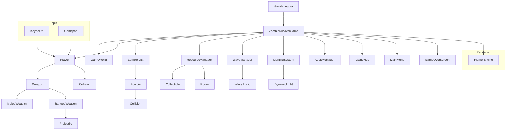

# Game Architecture Diagram

```mermaid
graph TD
    A[ZombieSurvivalGame] --> B[GameWorld]
    A --> C[Player]
    A --> D[Zombie List]
    A --> E[ResourceManager]
    A --> F[WaveManager]
    A --> G[LightingSystem]
    A --> H[AudioManager]
    A --> I[GameHud]
    
    C --> J[Weapon]
    C --> K[Collision]
    
    D --> L[Zombie]
    L --> M[Collision]
    
    J --> N[MeleeWeapon]
    J --> O[RangedWeapon]
    O --> P[Projectile]
    
    E --> Q[Collectible]
    E --> R[Room]
    
    F --> S[Wave Logic]
    
    G --> T[DynamicLight]
    
    A --> U[MainMenu]
    A --> V[GameOverScreen]
    
    W[SaveManager] --> A
    
    subgraph "Input"
        X[Keyboard]
        Y[Gamepad]
    end
    
    subgraph "Rendering"
        Z[Flame Engine]
    end
    
    X --> C
    Y --> C
    A --> Z
```